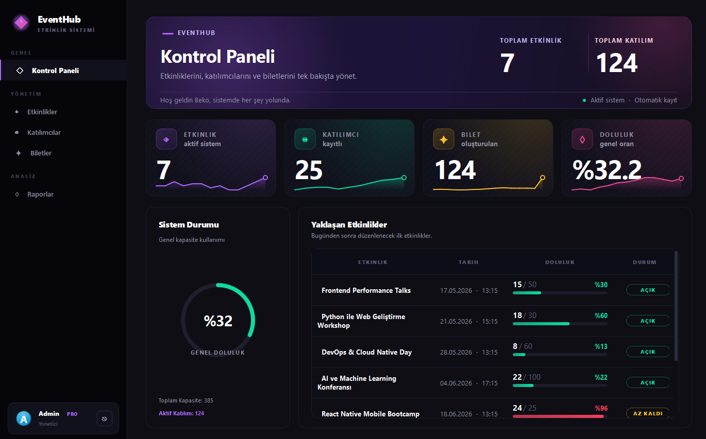
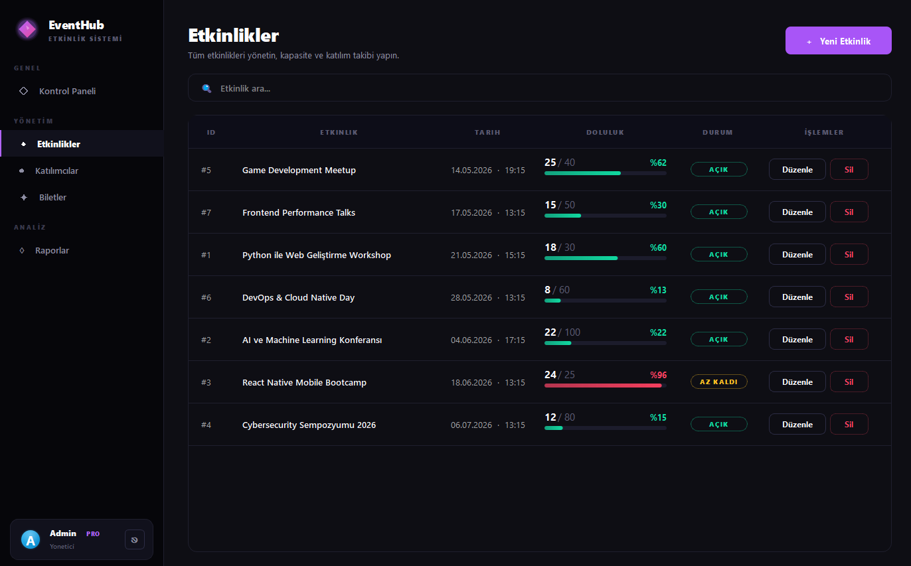
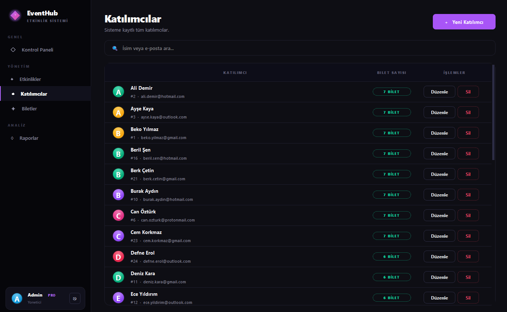
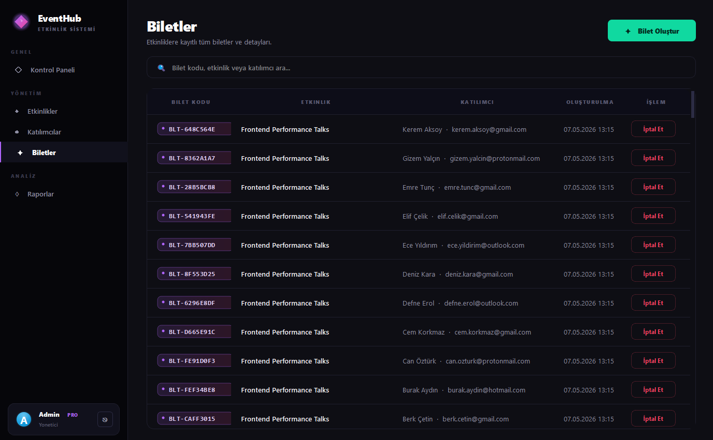
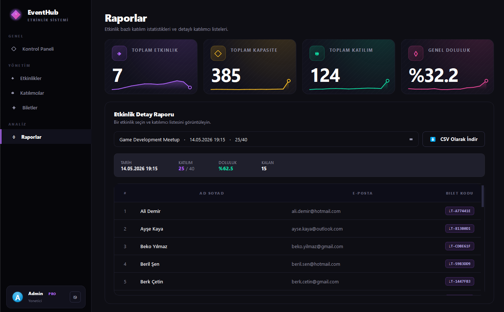

# EventHub - Etkinlik Kayit Sistemi

Etkinlik, katilimci ve bilet yonetimi yapan, JSON tabanli veri saklayan masaustu uygulamasidir. PyQt5 ile koyu temali, magenta accentli modern bir arayuz sunar.

## Teknolojiler

- **Python 3** - Programlama dili
- **PyQt5 (>=5.15.0)** - Masaustu GUI framework
- **JSON** - Veri kaliciligi

## Proje Yapisi

    etkinlik_kayit/
    ├── main.py                          # Ana giris noktasi
    ├── requirements.txt                 # Bagimliliklar
    ├── backend/
    │   ├── etkinlik.py                 # Etkinlik modeli
    │   ├── katilimci.py                # Katilimci modeli (email validasyonu)
    │   ├── bilet.py                    # Bilet modeli (factory)
    │   └── veri_yoneticisi.py          # Repository / persistence katmani
    ├── frontend/
    │   ├── ana_pencere.py              # Sidebar + sayfa yigini
    │   ├── tema.py                     # QSS stylesheet (koyu tema)
    │   ├── views/
    │   │   ├── dashboard.py            # Kontrol paneli
    │   │   ├── etkinlikler.py          # Etkinlik yonetimi
    │   │   ├── katilimcilar.py         # Katilimci yonetimi
    │   │   ├── biletler.py             # Bilet listesi
    │   │   └── raporlar.py             # Istatistikler ve CSV export
    │   └── widgets/
    │       ├── bilesenler.py           # IstatistikKart, Kart, DolulukGosterge
    │       └── diyaloglar.py           # Form modallari
    ├── images/                          # Ekran goruntuleri
    └── data/
        ├── etkinlikler.json
        ├── katilimcilar.json
        └── biletler.json

## Ana Siniflar

### Etkinlik (`backend/etkinlik.py`)

- **Ozellikler:** `etkinlik_id`, `ad`, `tarih`, `kapasite`
- **Metodlar:** `katilimci_ekle()` - kapasite kontrolu ile kayit

### Katilimci (`backend/katilimci.py`)

- **Ozellikler:** `katilimci_id`, `ad`, `email` (regex dogrulamali, benzersiz)

### Bilet (`backend/bilet.py`)

- **Ozellikler:** `bilet_id`, `etkinlik`, `katilimci`, `bilet_kodu` (BLT-XXXXXXXX formatinda)
- **Metodlar:** `bilet_olustur()` - factory metodu, otomatik kod uretimi

## Ozellikler

- **Dashboard:** 4 metrik (Toplam Etkinlik, Katilimci, Bilet, Doluluk Orani) + populer etkinlikler + son kayitlar
- **Etkinlik Yonetimi:** Etkinlik ekleme, duzenleme, silme; tarih ve kapasite takibi; doluluk gostergesi (yesil/sari/kirmizi)
- **Katilimci Yonetimi:** Benzersiz email kontrolu ile katilimci kayit, arama, filtreleme
- **Bilet Sistemi:** Otomatik bilet kodu uretimi (BLT-XXXXXXXX), etkinlik bazli bilet listesi
- **Raporlar:** Etkinlik bazli detayli katilim analizi, doluluk istatistikleri, CSV export
- **Is Kurallari:** Etkinlik kapasitesi dolunca kayit engellenir, ayni email tekrar kayit olamaz
- **Tasarim:** Koyu tema (siyah arkaplan) + magenta accent + modern gradient kartlar

## Ekran Goruntuleri

### Giris Ekrani

### Dashboard

### Etkinlikler

### Katilimcilar

### Biletler

### Raporlar

## Kurulum ve Calistirma

    pip install -r requirements.txt
    python main.py

## Varsayilan Giris

- **Kullanici adi:** `admin`
- **Sifre:** `admin123`

## Ornek Veri

Ilk calistirmada ornek etkinlik, katilimci ve bilet kayitlari otomatik olusturulur.
